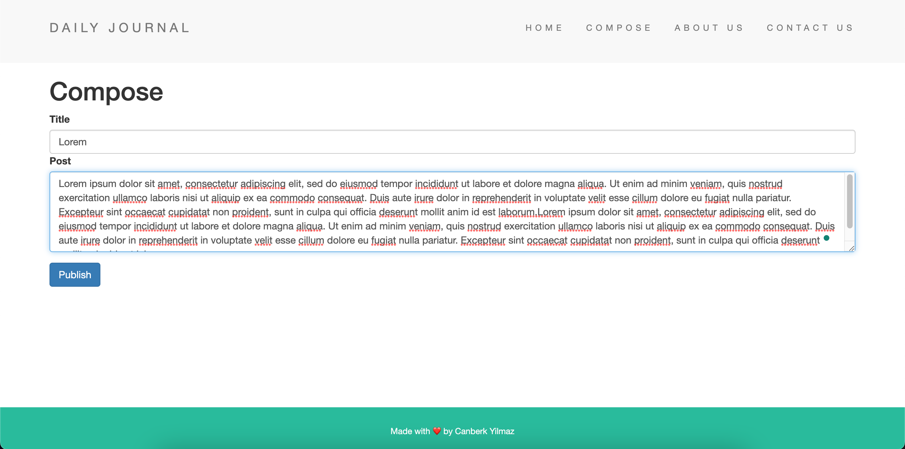
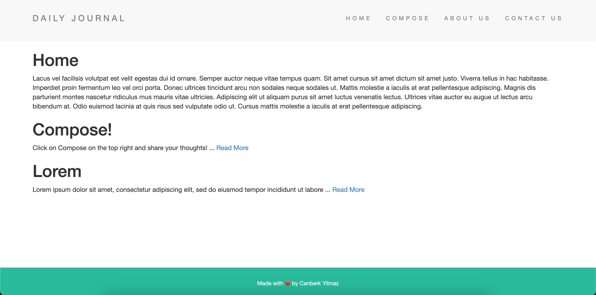
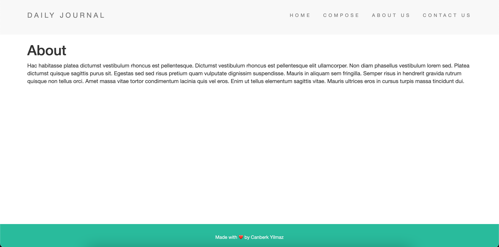
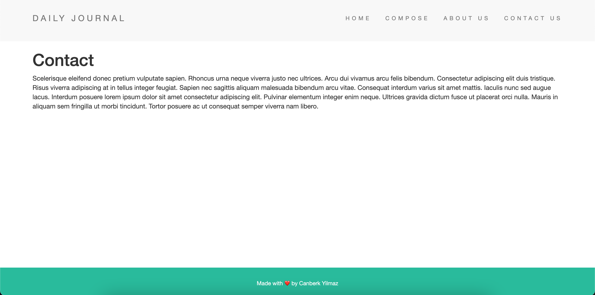

# Daily Journal

Daily Journal is a demo blog website that is deployed to Heroku. Go ahead and Compose !

The site website made by utilizing EJS, HTML, CSS, JavaScript, Bootstrap as well as MongoDB Atlas, NodeJS and NoSQL(MongoDB) for back-end.

Frameworks suchs as Express, Lodash and Mongoose implemented.

You can edit url to create and save your notes !

# Screenshot
Main Page (https://hidden-beach-22429.herokuapp.com/)

Compose (https://hidden-beach-22429.herokuapp.com/compose)

About (https://hidden-beach-22429.herokuapp.com/about)

Contact (https://hidden-beach-22429.herokuapp.com/contact)

